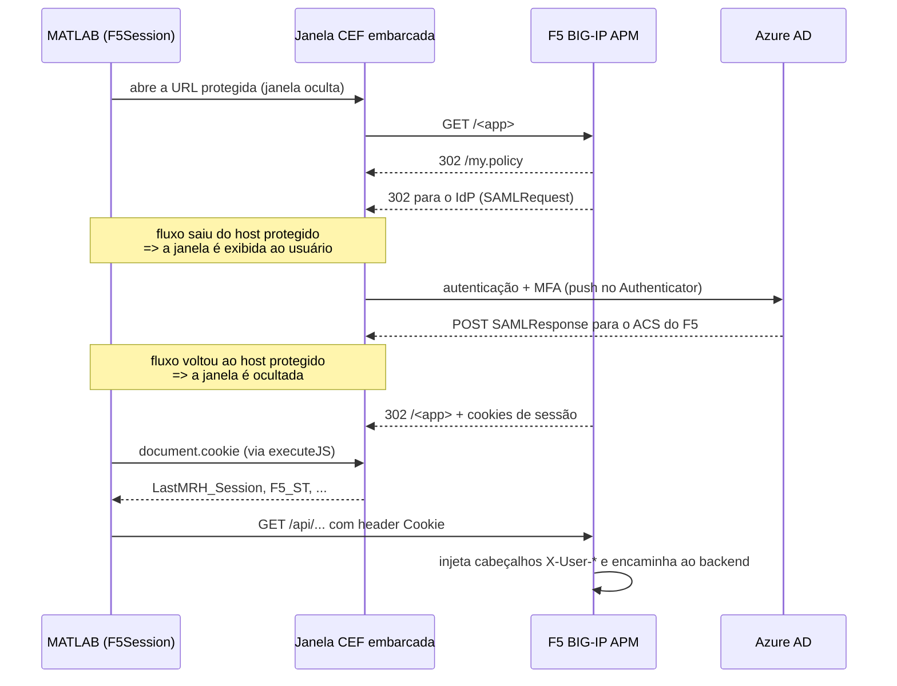

# ws.auth

Módulo compartilhado de autenticação para aplicações MATLAB desktop que consomem APIs publicadas atrás do proxy reverso **F5 BIG-IP APM**, com federação **SAML 2.0 / Azure AD** e **MFA**.

| Arquivo | Descrição |
|---|---|
| `F5Session.m` | Sessão autenticada reutilizável (`ws.auth.F5Session`) |
| `FileDownload.m` | Download assíncrono retomável em `backgroundPool` |
| `DownloadProgressMonitor.m` | Reporta o andamento das transferências ao chamador |
| `getMessage.m` | Carrega as mensagens localizadas do módulo |
| `resources/{en,pt}/catalog.m` | Catálogos de mensagens em inglês e português |

## Por que este módulo existe

O backend não possui lógica de autenticação própria: quem autentica é o F5. Uma vez concluído o login, o APM injeta cabeçalhos de identidade confiáveis (`X-User-Name`, `X-User-Email`, `X-User-Department`, `X-User-Job-Title`, `X-User-Location`) nas requisições encaminhadas ao backend.

Não existe token OAuth em nenhum ponto da cadeia — o que autoriza a chamada é o **cookie de sessão do APM**.

Consequência prática: para chamar a API a partir do MATLAB é preciso obter esse cookie, e a única forma de obtê-lo é um login humano completo. 

É isso que `F5Session` encapsula.

## Fluxo de autenticação



Pontos-chave da implementação:

- **Detecção de conclusão** — polling a cada 0,25 s executando `JSON.stringify({url: location.href, cookie: document.cookie})` na página. Considera-se concluído quando o host corresponde ao da URL protegida, o caminho não é `/my.policy` e os cookies obrigatórios (`LastMRH_Session` e `F5_ST`) estão presentes.
- **Leitura dos cookies** — possível via `document.cookie` porque os cookies do APM não são marcados `HttpOnly`. Nenhuma API nativa de gerenciamento de cookies é necessária.
- **Download independente** — para arquivos grandes, `FileDownload` executa as requisições por blocos em `backgroundPool`, mantendo a interface livre para outras requisições. O arquivo parcial pode ser retomado.
- **Janela sob demanda** — a janela é criada oculta. Só é exibida quando o fluxo sai do host protegido (redirecionamento ao IdP) ou quando o *landing* silencioso demora mais que 2 s. Se o CEF ainda tiver uma sessão válida, o login ocorre sem qualquer janela visível.
- **Detecção de expiração** — as requisições usam `MaxRedirects = 0`, de modo que o `302` do APM para `/my.policy` fica visível em vez de ser seguido silenciosamente. Códigos `3xx`, `401` e `403`, ou um corpo HTML de login, marcam a sessão como expirada.

## Pré-requisitos do ambiente

- MATLAB **R2024b ou superior** (multiplataforma: Windows, macOS e Linux).
- Parallel Computing Toolbox para downloads assíncronos com `FileDownload`.
- Acesso de rede ao host protegido e ao IdP.
- Usuário com acesso autorizado ao serviço para concluir o login e aprovar o push a cada nova sessão.

A aplicação publicada atrás do APM deve estar configurada como *SP-initiated SAML 2.0*, com o ACS no próprio F5 e o repasse de identidade ao backend por cabeçalhos `X-User-*`.

## Aplicações compiladas

O módulo carrega os catálogos em `+ws/+auth/resources` durante a execução. O MATLAB Compiler não garante a inclusão automática desses arquivos porque o caminho é resolvido dinamicamente. Cada aplicação compilada deve, portanto, adicionar explicitamente essa pasta aos arquivos do pacote.

O próprio módulo não pode configurar essa dependência: as opções de empacotamento pertencem ao ponto de entrada da aplicação consumidora. No script de compilação, localize a pasta sem depender do caminho do repositório:

```matlab
authFolder = fileparts(which('ws.auth.F5Session'));
authResources = fullfile(authFolder, 'resources');
```

Com `compiler.build.standaloneApplication`:

```matlab
compiler.build.standaloneApplication(appFile, ...
    'AdditionalFiles', authResources);
```

Se a aplicação já inclui outros arquivos adicionais, preserve-os na mesma lista:

```matlab
additionalFiles = [string(existingAdditionalFiles), string(authResources)];
compiler.build.standaloneApplication(appFile, ...
    'AdditionalFiles', additionalFiles);
```

Com `mcc`:

```matlab
mcc('-m', appFile, '-a', authResources)
```

No Application Compiler, adicione `authResources` em **Files installed for your end user**. A pasta deve conter os dois arquivos abaixo no pacote final:

```text
resources/en/catalog.m
resources/pt/catalog.m
```

Essa inclusão deve ser repetida no projeto ou script de compilação de cada aplicação que utiliza `ws.auth.F5Session`.

## Uso

```matlab
session = ws.auth.F5Session('<https service URL>');
login(session)     % bloqueia até o login concluir

data = read(session, 'https://<host>/<app>/api/v1/...');

delete(session)    % descarta a sessão da memória
```

### API pública

| Membro | Descrição |
|---|---|
| `F5Session(loginURL)` | Construtor. Exige HTTPS. |
| `login(obj, timeout)` | Login interativo. Bloqueia até obter os cookies. `timeout` padrão: 300 s. |
| `logout(obj)` | Descarta os cookies da memória e fecha a janela. |
| `read(obj, url, autoReauthenticate)` | GET autenticado, com o payload convertido pelo tipo de conteúdo. Em caso de sessão expirada, dispara nova autenticação (padrão) ou lança erro. |
| `readBytes(obj, url, autoReauthenticate, progressFcn)` | Idem, sem conversão do payload: devolve `uint8`. Útil para pequenos payloads binários ou diagnósticos. `progressFcn` é chamado como `f(bytesRecebidos, bytesTotais)`. |
| `FileDownload(session, url, filePath, chunkSize, maxRetries)` | Cria um download assíncrono retomável. Use `start`, `pause`, `resume` e `stop`; `ProgressFcn` recebe `f(bytesRecebidos, bytesTotais)`, `CompletedFcn` recebe o resumo e `ErrorFcn` recebe a exceção. |
| `debugInfo(obj)` | Diagnóstico: `LoginURL`, `IsAuthenticated`, `CookieCount` e `CookieNames`. |
| `IsAuthenticated` | Propriedade somente leitura. |
| `isSessionExpired(response)` | Estático. Avalia uma `ResponseMessage` já obtida. |

## Notas de segurança

- Os cookies existem **apenas em memória**, em propriedade privada, pelo tempo de vida do objeto. Nada é gravado em disco nem reaproveitado entre execuções do MATLAB.
- O valor do cookie não é persistido em disco. Durante um `FileDownload`, uma cópia em memória do cabeçalho é enviada ao worker de `backgroundPool` para que a transferência seja independente da thread principal.
- `debugInfo` expõe apenas nomes e quantidade de cookies, nunca os valores.
- `logout` sobrescreve o buffer do cabeçalho antes de liberá-lo.
- `logout` **não** encerra a sessão no lado do F5 nem limpa o cookie jar do CEF, que vive enquanto o processo do MATLAB existir. Um novo `login` após `logout` tende a concluir silenciosamente, reaproveitando a sessão do navegador.

## Limitação conhecida

`matlab.internal.webwindow` é uma API **não documentada**. É o mesmo componente usado internamente pelo App Designer, o que a torna estável na prática, mas as chamadas ao construtor, a `executeJS`, `show`/`hide` e `close` são a superfície de risco em atualizações do MATLAB. As alternativas avaliadas foram descartadas: WebView2 restringe a Windows, e `uihtml` não serve porque o IdP envia `X-Frame-Options`/CSP que impedem o *framing* das páginas de login.

## Exemplos

Ver [tests/auth](../../../../tests/auth/README.md):

- [checkF5Auth.m](../../../../tests/auth/checkF5Auth.m) — script de validação, seção a seção.
- [F5BrowserTestApp.m](../../../../tests/auth/F5BrowserTestApp.m) — app `uifigure` que demonstra a integração completa.
