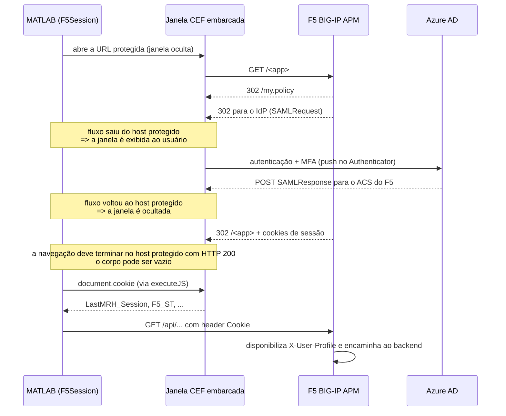

# ws.auth

Módulo compartilhado de autenticação para aplicações MATLAB desktop que consomem APIs publicadas atrás do proxy reverso **F5 BIG-IP APM**, com federação **SAML 2.0 / Azure AD** e **MFA**.

| Arquivo | Descrição |
|---|---|
| `F5Session.m` | Sessão autenticada reutilizável (`ws.auth.F5Session`) |
| `FileTransfer.m` | Transferência assíncrona retomável em `backgroundPool` |
| `DownloadProgressMonitor.m` | Reporta o progresso de `F5Session.readBytes` quando o chamador fornece um callback |
| [`TransferManager`](../../../General/+datatransfer/TransferManager.m) | Orquestra tarefas, conflitos, callbacks e snapshots sem conhecer UI ou F5 |
| [`+datatransfer`](../../../General/+datatransfer) | Serviços HTTP, nomes de arquivos, metadados e worker provider-neutral |
| [`profileAvatar.html`](profileAvatar.html) | Componente `uihtml` reutilizável para indicar o estado e o perfil autenticado |
| [`TransferPanel`](../../../General/+ui/TransferPanel.m) | Painel reutilizável de transferências; recebe um `TransferFactory` e não conhece a autenticação |

## Por que este módulo existe

O backend não possui lógica de autenticação própria: quem autentica é o F5. Uma vez concluído o login, o APM associa a identidade autenticada às requisições encaminhadas ao backend. Quando disponível, o cabeçalho `X-User-Profile` contém o perfil JSON consumido por `F5Session`.

Não existe token OAuth em nenhum ponto da cadeia — o que autoriza a chamada é o **cookie de sessão do APM**.

Consequência prática: para chamar a API a partir do MATLAB é preciso obter esse cookie, e a única forma de obtê-lo é um login humano completo. 

É isso que `F5Session` encapsula.

## Fluxo de autenticação


```mermaid
sequenceDiagram
    participant M as MATLAB (F5Session)
    participant B as Janela CEF embarcada
    participant F as F5 BIG-IP APM
    participant A as Azure AD

    M->>B: abre a URL protegida (janela oculta)
    B->>F: GET /<app>
    F-->>B: 302 /my.policy
    F-->>B: 302 para o IdP (SAMLRequest)
    Note over M,B: fluxo saiu do host protegido<br/>=> a janela é exibida ao usuário
    B->>A: autenticação + MFA (push no Authenticator)
    A-->>B: POST SAMLResponse para o ACS do F5
    Note over M,B: fluxo voltou ao host protegido<br/>=> a janela é ocultada
    F-->>B: 302 /<app> + cookies de sessão
    Note over M,B: a navegação deve terminar no host protegido com HTTP 200<br/>o corpo pode ser vazio
    M->>B: document.cookie (via executeJS)
    B-->>M: LastMRH_Session, F5_ST, ...
    M->>F: GET /api/... com header Cookie
    F->>F: disponibiliza X-User-Profile e encaminha ao backend
```

Pontos-chave da implementação:

- **Detecção de conclusão** — polling a cada 0,25 s executando `JSON.stringify({url: location.href, cookie: document.cookie})` na página. A URL de login deve terminar no host protegido com uma resposta HTTP `200`; o corpo dessa página pode ser vazio. Considera-se concluído quando os cookies obrigatórios (`LastMRH_Session` e `F5_ST`) estão presentes. Uma resposta `204` não é adequada para esse fluxo porque mantém o documento do provedor de identidade, cujo `document.cookie` não expõe os cookies do F5. Depois disso, a classe faz uma tentativa independente de ler `X-User-Profile` usando a `LoginURL` e os cookies capturados.
- **Leitura dos cookies** — possível via `document.cookie` porque os cookies do APM não são marcados `HttpOnly`. Nenhuma API nativa de gerenciamento de cookies é necessária.
- **Download independente** — para arquivos grandes, `FileTransfer` executa as requisições por blocos em `backgroundPool`, mantendo a interface livre para outras requisições. O arquivo parcial pode ser retomado.
- **Janela sob demanda** — a janela é criada oculta. Só é exibida quando o fluxo sai do host protegido (redirecionamento ao IdP) ou quando o *landing* silencioso demora mais que 2 s. Se o CEF ainda tiver uma sessão válida, o login ocorre sem qualquer janela visível.
- **Detecção de expiração** — o transporte HTTP desativa redirecionamentos automáticos do MATLAB e os trata manualmente. Para um contexto elegível no host F5 exato em HTTPS, uma resposta `3xx` sinaliza `NeedsAuthentication`; requisições com corpo nunca seguem nem repetem um redirecionamento. Códigos `401` e `403`, ou um corpo HTML de login, também indicam sessão expirada.

## Pré-requisitos do ambiente

- MATLAB **R2024b ou superior** (multiplataforma: Windows, macOS e Linux).
- Parallel Computing Toolbox para downloads assíncronos com `FileTransfer`.
- Acesso de rede ao host protegido e ao IdP.
- Usuário com acesso autorizado ao serviço para concluir o login e aprovar o push a cada nova sessão.

A aplicação publicada atrás do APM deve estar configurada como *SP-initiated SAML 2.0*, com o ACS no próprio F5 e o repasse de identidade ao backend por cabeçalhos `X-User-*`.

## Aplicações compiladas

O checkout atual não contém `getMessage.m`, uma pasta `resources` ou catálogos de mensagens. As aplicações compiladas que usam os avatares `uihtml` devem incluir explicitamente os dois arquivos HTML existentes.

O próprio módulo não pode configurar essa dependência: as opções de empacotamento pertencem ao ponto de entrada da aplicação consumidora. No script de compilação, localize a pasta sem depender do caminho do repositório:

```matlab
authFolder = fileparts(which('ws.auth.F5Session'));
uiFolder = fileparts(which('ui.TransferPanel'));
authProfileAvatar = fullfile(authFolder, 'profileAvatar.html');
uiTransferAvatar = fullfile(uiFolder, 'html', 'pingTransferAvatar.html');
```

Com `compiler.build.standaloneApplication`:

```matlab
compiler.build.standaloneApplication(appFile, ...
    'AdditionalFiles', [string(authProfileAvatar), string(uiTransferAvatar)]);
```

Se a aplicação já inclui outros arquivos adicionais, preserve-os na mesma lista:

```matlab
additionalFiles = [string(existingAdditionalFiles), string(authProfileAvatar), ...
                   string(uiTransferAvatar)];
compiler.build.standaloneApplication(appFile, ...
    'AdditionalFiles', additionalFiles);
```

Com `mcc`:

```matlab
mcc('-m', appFile, '-a', authProfileAvatar, ...
    '-a', uiTransferAvatar)
```

No Application Compiler, adicione `authProfileAvatar` e `uiTransferAvatar` em **Files installed for your end user**. Essa inclusão deve ser repetida no projeto ou script de compilação de cada aplicação que utiliza `ws.auth.F5Session`.

## Uso

```matlab
loginURL = 'https://<host>/<app>/api/users/login'; % deve terminar em HTTP 200
session = ws.auth.F5Session(loginURL);
login(session)     % o corpo da página de landing pode ser vazio

data = read(session, 'https://<host>/<app>/api/v1/...');

delete(session)    % descarta a sessão da memória
```

### Componente de avatar

`profileAvatar.html` é um componente `uihtml` reutilizável para exibir um avatar
desconectado, a inicial do usuário autenticado ou uma foto PNG em Base64. O
componente fica no pacote `ws.auth`; aplicações consumidoras devem referenciá-lo
diretamente, sem copiar o HTML para a pasta da aplicação:

```matlab
authFolder = fileparts(which('ws.auth.F5Session'));
avatarHTML = uihtml(parentContainer);
avatarHTML.HTMLSource = fullfile(authFolder, 'profileAvatar.html');
avatarHTML.HTMLEventReceivedFcn = @avatarEventReceived;
```

Depois que o componente emitir o evento `profileAvatarReady`, a aplicação pode
atualizar `avatarHTML.Data` com um struct no formato abaixo:

```matlab
state = struct('action', 'render', ...
               'connected', true, ...
               'initial', 'A', ...
               'photoPngBase64', '');
avatarHTML.Data = state;
```

Use `connected = false` para exibir o estado desconectado. O componente emite
`profileAvatarClick` quando o usuário pressiona o avatar; a aplicação pode usar
esse evento para iniciar o login ou abrir o menu do perfil.

### Painel de downloads

`ui.TransferPanel` fica em `src/General/+ui` e é independente de
`F5Session`. Ele recebe um `TransferFactory`, renderiza snapshots do
`datatransfer.TransferManager` e traduz ações da UI em comandos do manager.
O HTML em `src/General/+ui/html/pingTransferAvatar.html` é o avatar usado pelo
painel e deve ser incluído explicitamente em aplicações compiladas. O avatar
agregado opcional `orbitDownloadAvatar.html` preserva a visualização de níveis
e órbitas para comparação ou reutilização independente; não é carregado por
`ui.TransferPanel`. Seu harness manual é
[`checkOrbitDownloadHtml.m`](../../../../tests/transfers/checkOrbitDownloadHtml.m).

Os serviços provider-neutral ficam em `src/General/+datatransfer`: use
`datatransfer.transferFileName`, `datatransfer.downloadSourceMetadata`,
`datatransfer.sendHTTPRequest` e `datatransfer.downloadFileWorker` para o
transporte e o processamento genérico de downloads. O `FileTransfer` é o
adaptador F5 de download: fornece o `requestContext` autenticado e passa
`@datatransfer.downloadFileWorker` ao `backgroundPool`. O manager recebe somente
a fábrica injetada e nunca inspeciona cookies, sessões ou handles de UI.

```matlab
panel = ui.TransferPanel(parentContainer, ...
    'TransferFactory', @createTransfer, ...
    'executionMode', 'desktopStandaloneApp', ...
    'tempPath', tempFolder, ...
    'targetPath', targetFolder);

panel.AvatarHTML.Layout.Row = 1;
panel.AvatarHTML.Layout.Column = 3;
panel.addDownload(url);
```

O factory recebe uma struct normalizada com `Direction`, `URL`, `TaskID`,
`TempFolder`, `LocalPath` e `FileName`; `LocalPath` é o destino local do download.
O construtor de `FileTransfer` exige esses campos e aceita somente
`Direction = 'download'` até que exista um adaptador de upload. O callback
`ProgressFcn` recebe `(transferredBytes, totalBytes)`, e o resumo de conclusão
inclui `LocalPath` e `TransferredBytes`.
O objeto devolvido deve expor
`start`, `pause`, `resume`, `stop`, `ProgressFcn`, `CompletedFcn` e
`ErrorFcn`. O painel passa a solicitação à fábrica; `FileTransfer` executa o
worker de download. A mesma fábrica pode tratar fontes públicas e F5 sem que o
painel conheça o transporte.

Para uma aplicação que usa F5, o factory pode sempre usar a mesma chamada:

```matlab
panel = ui.TransferPanel(parentContainer, ...
    'TransferFactory', @(request) ws.auth.FileTransfer(session, request), ...
    'executionMode', 'MATLABEnvironment', ...
    'tempPath', tempFolder, ...
    'targetPath', targetFolder);
```

Passar uma sessão não inicia autenticação. O login é feito somente quando o
download recebe uma resposta de autenticação para o host F5. URLs públicas
HTTP ou HTTPS são baixadas sem cookies. URLs autenticadas exigem HTTPS.

O painel sugere o último segmento útil da URL como nome de arquivo. Em modos
desktop, o nome escolhido pelo usuário é usado como destino. Em `webApp`, não há
diálogo: se a URL não tiver um nome útil, o painel cria um fallback no formato
`YYMMDD_HHmm_<dominio>_<UID>.download`; para esse caso, `FileTransfer` pode
substituí-lo pelo nome de `Content-Disposition` (`filename*` antes de
`filename`). Os pontos do domínio são substituídos por hífens, por exemplo
`260923_1430_httpbin-org_a1b2c3d4.download`. O painel reutiliza o fallback
gerado para a mesma URL durante sua vida, permitindo encontrar um arquivo
parcial depois de `stop`.

`executionMode` aceita `webApp`, `desktopStandaloneApp` e
`MATLABEnvironment`. O último usa o mesmo comportamento de download do modo
desktop. Em todos os modos, quando o destino já existe, a linha fica em espera
com os controles **Keep existing**, **Restart** e **Cancel** abaixo da barra;
o downloader só é criado depois da escolha, exceto ao manter o arquivo existente.
O callback de conclusão deve
publicar o arquivo em `LocalPath` e remover os arquivos temporários de
sucesso.

Tarefas não terminais são deduplicadas pela URL exata e pelo nome de arquivo
selecionado, sem distinguir pasta de destino ou `DisplayMode`. Repetir uma
solicitação normal para uma tarefa silenciosa torna a tarefa visível, promove
sua linha e abre o painel. A repetição não registra uma nova tentativa; pausar
e retomar também preserva os timestamps existentes.

### API pública

| Membro | Descrição |
|---|---|
| `F5Session(loginURL)` | Construtor. Exige uma URL HTTPS de login, armazenada em `LoginURL`; `Domain` contém o host exato usado para limitar cookies e reautenticação. |
| `login(obj, timeout, debugFile)` | Login interativo. Aguarda os cookies obrigatórios e exige uma landing page HTTP 200 no host protegido; o corpo pode ser vazio. `timeout` padrão: 300 s. Se o usuário não continuar após o timeout, o método retorna sem autenticar. Se `debugFile` for informado, registra o estado bruto e decodificado do navegador para diagnóstico. |
| `logout(obj)` | Descarta os cookies da memória e fecha a janela. |
| `read(obj, url, autoReauthenticate)` | GET autenticado, com o payload convertido pelo tipo de conteúdo. Em caso de sessão expirada, dispara nova autenticação (padrão) ou lança erro. |
| `readBytes(obj, url, autoReauthenticate, progressFcn)` | Idem, sem conversão do payload: devolve `uint8`. Útil para pequenos payloads binários ou diagnósticos. `progressFcn` é chamado como `f(bytesRecebidos, bytesTotais)`. |
| `FileTransfer(session, request, chunkSize, maxRetries)` | Cria um download assíncrono retomável. A solicitação exige `Direction = 'download'`, `URL`, `TaskID`, `TempFolder`, `LocalPath` e `FileName`; uploads são rejeitados até existir o adaptador correspondente. URLs públicas e F5 são aceitas; `start` autentica sob demanda somente após uma resposta de autenticação do host exato da sessão. |
| `debugInfo(obj)` | Diagnóstico: `LoginURL`, `IsAuthenticated`, `CookieCount` e `CookieNames`. |
| `IsAuthenticated` | Propriedade somente leitura. |
| `UserProfile` | Perfil do usuário associado à sessão autenticada. Somente leitura para a aplicação. |
| `getAuthenticationInfo()` | Retorna `[isAuthenticated, userProfile]`. Quando não autenticada, `userProfile` é um struct vazio. |
| `AuthenticationChanged` | Evento disparado após login bem-sucedido, `logout` de uma sessão autenticada ou atualização do perfil, inclusive quando a autenticação é iniciada implicitamente por `read` ou `FileTransfer`. Não é disparado por `delete`. |
| `isSessionExpired(response)` | Estático. Avalia uma `ResponseMessage` já obtida. |

## Notas de segurança

- Os cookies existem **em memória**, em propriedade privada, pelo tempo de vida do objeto. Durante a operação normal nada é gravado em disco nem reaproveitado entre execuções do MATLAB; se `debugFile` for informado, o estado bruto do navegador, que pode conter valores de cookies, é gravado para diagnóstico.
- O valor do cookie não é persistido em disco. Durante um `FileTransfer`, uma cópia em memória do cabeçalho é enviada ao worker de `backgroundPool` para que a transferência seja independente da thread principal.
- Cookies são enviados somente para o host exatamente igual a `F5Session.Domain`. Não são enviados para subdomínios, domínio pai, outros hosts ou após um redirecionamento para outro host. O escopo não considera caminhos: a regra é exclusivamente o host exato.
- A sessão é opcional do ponto de vista do transporte: uma URL pública não recebe cookies F5. A existência de um objeto `F5Session` não dispara login durante a construção de `FileTransfer`.
- `debugInfo` expõe apenas nomes e quantidade de cookies, nunca os valores.
- O `debugFile` de `login` pode conter cookies de autenticação; use-o somente para diagnóstico local e remova-o após a análise.
- `logout` sobrescreve o buffer do cabeçalho antes de liberá-lo.
- `logout` **não** encerra a sessão no lado do F5 nem limpa o cookie jar do CEF, que vive enquanto o processo do MATLAB existir. Um novo `login` após `logout` tende a concluir silenciosamente, reaproveitando a sessão do navegador.

## Limitação conhecida

`matlab.internal.webwindow` é uma API **não documentada**. É o mesmo componente usado internamente pelo App Designer, o que a torna estável na prática, mas as chamadas ao construtor, a `executeJS`, `show`/`hide` e `close` são a superfície de risco em atualizações do MATLAB. As alternativas avaliadas foram descartadas: WebView2 restringe a Windows, e `uihtml` não serve porque o IdP envia `X-Frame-Options`/CSP que impedem o *framing* das páginas de login.

## Exemplos

Ver [tests/auth](../../../../tests/auth/README.md):

- [checkF5Auth.m](../../../../tests/auth/checkF5Auth.m) — script de validação, seção a seção.
- [F5BrowserTestApp.m](../../../../tests/auth/F5BrowserTestApp.m) — app `uifigure` que demonstra a integração completa.
- [checkOrbitDownloadHtml.m](../../../../tests/transfers/checkOrbitDownloadHtml.m) — harness isolado do avatar agregado opcional.